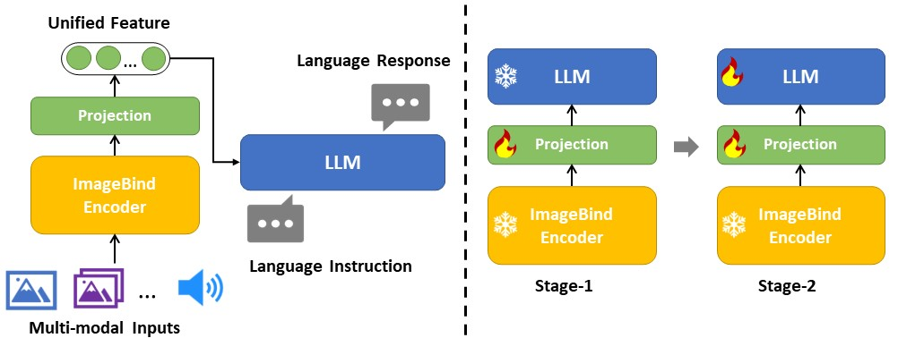
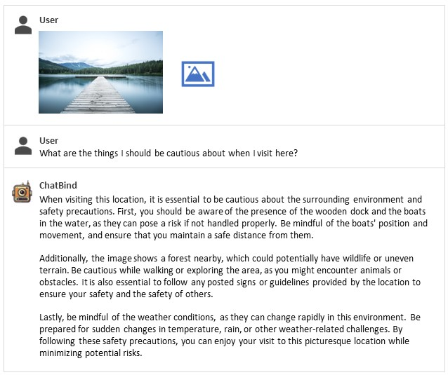
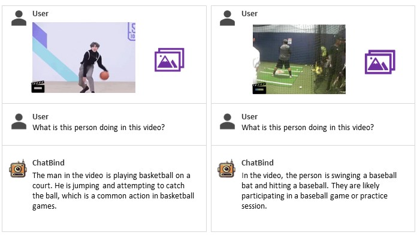
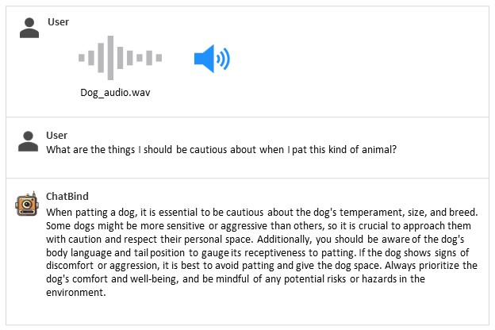

# ChatBind: Bind All Modalities to Chat

**HKU & Tencent ARC Lab**

**Team:** [Jintao Lin](https://github.com/dreamerlin)<sup>\*</sup>, 
[Yi Chen](https://github.com/MilkWhite)<sup>\*</sup>, 
[Yixiao Ge](https://geyixiao.com/), 
[Xihui Liu](https://xh-liu.github.io/) (Equal contributors<sup>\*</sup>)

<p align="center">
     <br>
    Generated by <a href="https://www.midjourney.com/">Midjourney</a> via text prompt "An intelligent robot combining radio, camera, and multimodal sensors"
</p>

## Release

- [5/25] We released **ChatBind v0.1**, which binds all Modalities to chat, including images, audio, video etc.
The repo is still work-in-progress and we are working on a more stable model. Stay tuned! 

[](https://github.com/tatsu-lab/stanford_alpaca/blob/main/LICENSE)
[](https://github.com/tatsu-lab/stanford_alpaca/blob/main/DATA_LICENSE)
**Usage and License Notices**: The data, code and checkpoint is intended and licensed for research use only. 
They are also restricted to uses that follow the license agreement of LLaMA, Vicuna and GPT-4. 
The dataset is CC BY NC 4.0 (allowing only non-commercial use) and models trained using the dataset should not be used outside of research purposes.


## Introduction

ChatBind connects pre-trained [ImageBind](https://github.com/facebookresearch/ImageBind) ViT-H/14 multimodal encoder and large language model Vicuna, 
using a simple projection matrix. We consider a two-stage instruction-tuning procedure following [LLaVa](https://github.com/haotian-liu/LLaVA):

- Stage 1: Pre-training for Feature Alignment. Only the projection matrix is updated, based on a subset of CC3M.
- Stage 2: Fine-tuning End-to-End. Both the projection matrix and LLM are updated for multimodal chat.

<p align="center">
    
</p>

## Examples

<p align="center">
    
</p>

<p align="center">
    
</p>

<p align="center">
    
</p>

## Contents
- [Data Download](#data-download)
- [Install](#install)
- [ChatBind Weights](#chatbind-weights)
- [Inference](#inference)
- [Evaluation](#evaluation)
- [Training](#training)
- [Citation](#citation)
- [Related Projects](#Related-projects)

## Data Download

In this part, we follow the dataset preparation from [LLaVa](https://github.com/haotian-liu/LLaVA). Thanks for their great work!

### Pretraining Dataset

The pretraining dataset used in this release is a subset of CC-3M dataset, filtered with a more balanced concept coverage distribution. 
Please see [here](https://huggingface.co/datasets/liuhaotian/LLaVA-CC3M-Pretrain-595K) for a detailed description on the dataset structure and how to download the images.

If you already have CC-3M dataset on your disk, the image names follow this format: `GCC_train_000000000.jpg`.  You may edit the `image` field correspondingly if necessary.

| Data | Chat File | Meta Data | Size |
| --- |  --- |  --- | ---: |
| CC-3M Concept-balanced 595K | [chat.json](https://huggingface.co/datasets/liuhaotian/LLaVA-CC3M-Pretrain-595K/raw/main/chat.json) | [metadata.json](https://huggingface.co/datasets/liuhaotian/LLaVA-CC3M-Pretrain-595K/raw/main/metadata.json) | 211 MB
| LAION/CC/SBU BLIP-Caption Concept-balanced 558K | [blip_laion_cc_sbu_558k.json](https://huggingface.co/datasets/liuhaotian/LLaVA-Pretrain/raw/main/blip_laion_cc_sbu_558k.json) | [metadata.json](#) | 181 MB


### Tuning Dataset

| Data file name | Size |
| --- | ---: |
| [llava_instruct_150k.json](https://huggingface.co/datasets/liuhaotian/LLaVA-Instruct-150K/raw/main/llava_instruct_150k.json) | 229 MB |
| [llava_instruct_80k.json](https://huggingface.co/datasets/liuhaotian/LLaVA-Instruct-150K/raw/main/llava_instruct_80k.json) | 229 MB |
| [conversation_58k.json](https://huggingface.co/datasets/liuhaotian/LLaVA-Instruct-150K/raw/main/conversation_58k.json) | 126 MB |
| [detail_23k.json](https://huggingface.co/datasets/liuhaotian/LLaVA-Instruct-150K/raw/main/detail_23k.json) | 20.5 MB |
| [complex_reasoning_77k.json](https://huggingface.co/datasets/liuhaotian/LLaVA-Instruct-150K/raw/main/complex_reasoning_77k.json) | 79.6 MB |

To download the langauge-image multimodal instruction-folllowing dataset [`LLaVA-Instruct-150K`](https://huggingface.co/datasets/liuhaotian/LLaVA-Instruct-150K), 
please run the following script:
```bash
sh download_data.sh
```


## Install

1. Clone this repository and navigate to ChatBind folder
```bash
git clone https://github.com/dreamerlin/chatbind.git
cd chatbind
```

2. Install Package
```Shell
conda create -n chatbind python=3.10 -y
conda activate chatbind
pip install --upgrade pip  # enable PEP 660 support
pip install -e .
pip install ftfy iopath timm torchaudio pytorchvideo einops
```

3. Install additional packages for training cases
```
pip install ninja
pip install flash-attn
```

## ChatBind Weights

### ImageBind weights

For the ImageBind weights, please refer to the original [repo](https://github.com/facebookresearch/ImageBind#imagebind-model) to download it.

### ChatBind-7B
We release our weights as delta weights to comply with the LLaMA model license.
You can add our delta to the original LLaMA weights to obtain the ChatBind weights.
Here are the Instructions:

1. Get the original LLaMA weights in the huggingface format by following the instructions [here](https://huggingface.co/docs/transformers/main/model_doc/llama).
2. Use the following scripts to get ChatBind weights by applying our delta ([7b](https://huggingface.co/dreamerlin/chatbind-7b-delta)). It will automatically download delta weights from our Hugging Face account.


This conversion command needs around 30 GB of CPU RAM.
```bash
python3 -m chatbind.model.apply_delta \
    --base /path/to/llama-7b \
    --target /output/path/to/chatbind-7b \
    --delta dreamerlin/chatbind-7b-delta
```


### ChatBind pretrained projector weights
The initial release is pretrained on [LLaVA-filtered CC3M 595K](https://huggingface.co/datasets/liuhaotian/LLaVA-CC3M-Pretrain-595K) with 1 epoch. 
The pretrained weights are released [here](https://huggingface.co/dreamerlin/chatbind-7b-pretrain-projector).

You may perform instruction tuning on our pretrained checkpoints, 
by using the [visual instruction tuning](https://huggingface.co/datasets/liuhaotian/LLaVA-Instruct-150K) data 
following the instructions [here](https://github.com/haotian-liu/LLaVA#fine-tuning-with-local-gpus).

## Inference

### CLI Inference

A starting script for inference with ChatBind without the need of Gradio interface. 
The current implementation only supports for a single-turn Q-A session. 
This also serves as an example for users to build customized inference scripts.

```Shell
python -m chatbind.eval.run_chatbind \
    --model-name /path/to/chatbind-7b \
    --input-file ".assets/dog_image.jpg" \
    --query "What are the things I should be cautious about when I pat it?"
```

## Evaluation

### GPT-assisted Evaluation

Following [LLaVa](https://github.com/haotian-liu/LLaVA), the GPT-assisted evaluation pipeline for multimodal modeling is provided for a comprehensive understanding of the capabilities of vision-language models.

1. Generate ChatBind responses

```Shell
python model_vqa.py \
    --model-name ./checkpoints/chatbind-7b \
    --question-file \
    playground/data/coco2014_val_qa_eval/qa90_questions.jsonl \
    --image-folder \
    /path/to/coco2014_val \
    --answers-file \
    /path/to/answer-file.jsonl
```

2. Evaluate the generated responses.  In our case, [`answer-file-1.jsonl`](./playground/data/coco2014_val_qa_eval/qa90_gpt4_answer.jsonl) is the response generated by text-only GPT-4 (0314), with the context captions/boxes provided.

```Shell
OPENAI_API_KEY="sk-***********************************" python eval_gpt_review_visual.py \
    --question playground/data/coco2014_val_qa_eval/qa90_questions.jsonl \
    --context table/caps_boxes_coco2014_val_80.jsonl \
    --answer-list \
    /path/to/answer-file-1.jsonl \
    /path/to/answer-file-2.jsonl \
    --rule table/rule.json \
    --output /path/to/review.json
```

3. Summarize the evaluation results

```Shell
python summarize_gpt_review.py
```

## Training

### Training with Local GPUs
ChatBind is trained on 4 A100 GPUs with 40GB memory with the following code. 
To train on fewer GPUs, you can reduce the `per_device_train_batch_size` and increase the `gradient_accumulation_steps` accordingly to keep the global batch size the same.

1. Pretraining

```Shell
torchrun --nnodes=1 --nproc_per_node=4 --master_port=25001 \
    chatbind/train/train_imagebind_select_mem.py \
    --model_name_or_path ./checkpoints/vicuna-7b \
    --data_path /path/to/cc3m_595k.json \
    --image_folder /path/to/cc3m_595k \
    --vision_tower openai/clip-vit-large-patch14 \
    --tune_mm_mlp_adapter True \
    --mm_vision_select_layer -2 \
    --mm_use_im_start_end \
    --bf16 True \
    --output_dir ./checkpoints/chatbind-7b-pretrain \
    --num_train_epochs 1 \
    --per_device_train_batch_size 16 \
    --per_device_eval_batch_size 4 \
    --gradient_accumulation_steps 2 \
    --evaluation_strategy "no" \
    --save_strategy "steps" \
    --save_steps 2400 \
    --save_total_limit 1 \
    --learning_rate 2e-3 \
    --weight_decay 0. \
    --warmup_ratio 0.03 \
    --lr_scheduler_type "cosine" \
    --logging_steps 1 \
    --tf32 True \
    --model_max_length 2048 \
    --gradient_checkpointing True \
    --lazy_preprocess True \
    --report_to wandb
```


2. Extract projector features
```Shell
python scripts/extract_mm_projector.py \
  --model_name_or_path ./checkpoints/chatbind-7b-pretrain \
  --output ./checkpoints/mm_projector/chatbind-7b-pretrain.bin
```

3. Finetuning

```Shell
torchrun --nnodes=1 --nproc_per_node=4 --master_port=25001 \
    chatbind/train/train_imagebind_select_mem.py \
    --model_name_or_path /path/to/vicuna-7b \
    --data_path /path/to/llava_instruct_150k.json \
    --image_folder /path/to/coco/train2014 \
    --vision_tower openai/clip-vit-large-patch14 \
    --pretrain_mm_mlp_adapter ./checkpoints/mm_projector/chatbind-7b-pretrain.bin \
    --mm_vision_select_layer -2 \
    --mm_use_im_start_end True \
    --bf16 True \
    --output_dir ./checkpoints/chatbind-7b \
    --num_train_epochs 3 \
    --per_device_train_batch_size 4 \
    --per_device_eval_batch_size 4 \
    --gradient_accumulation_steps 2 \
    --evaluation_strategy "no" \
    --save_strategy "steps" \
    --save_steps 5000 \
    --save_total_limit 3 \
    --learning_rate 2e-5 \
    --weight_decay 0. \
    --warmup_ratio 0.03 \
    --lr_scheduler_type "cosine" \
    --logging_steps 1 \
    --tf32 True \
    --fsdp "full_shard auto_wrap" \
    --fsdp_transformer_layer_cls_to_wrap 'LlamaDecoderLayer' \
    --model_max_length 2048 \
    --gradient_checkpointing True \
    --lazy_preprocess True \
    --report_to wandb
```

## Citation

If you find ChatBind useful in your research or applications, please kindly cite using the following BibTeX:

```
@misc{chatbind2023,
    title={ChatBind: Bind all Modalities to Chat},
    author={Jintao Lin, Yi Chen, Yixiao Ge, Xihui Liu},
    howpublished = {\url{https://github.com/dreamerlin/chatbind}},
    year={2023}
}
```

## Related Projects

- [Instruction Tuning with GPT-4](https://github.com/Instruction-Tuning-with-GPT-4/GPT-4-LLM)
- [Vicuna](https://github.com/lm-sys/FastChat)
- [LLaVa](https://github.com/haotian-liu/LLaVA)
- [ImageBind](https://github.com/facebookresearch/ImageBind)

